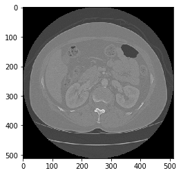
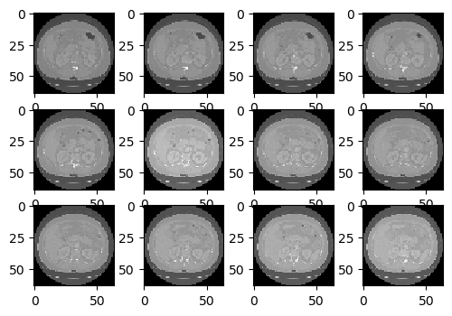
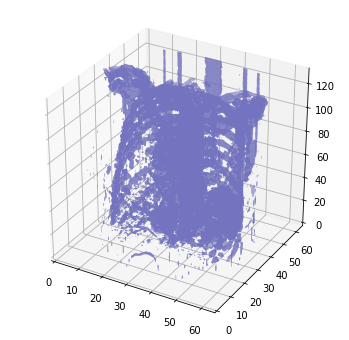
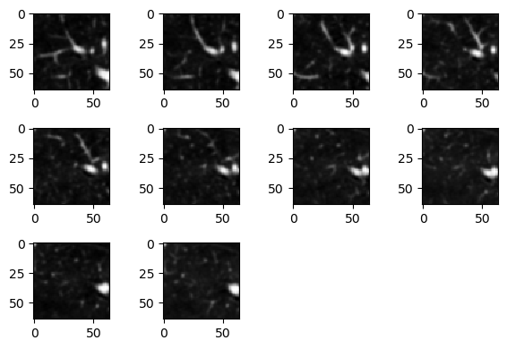

# Advanced Architecture: CNN3D

In this repo, I extend my [CNN Advanced Architecture](https://github.com/mbastola/neural-nets-in-python/tree/master/convolutional-neural-nets/cnn-advanced-architecture) project to 3D space. The architecture is advanced in the sense that it is flexible and can read & build its architecture from JSON files. The 3D extension allows CNN3D classifier to tackle 3D image tensors such as CT Scan images, which we will we working with in this repo. I have trained the LUNA16 dataset with the usual my CNN and then with CNN3D classes and noted that CNN3D outperfromed the predictions for the LUNA16 dataset.  

## LUNA16
LUng Nodule Analysis data includes 888 CT Scans of Lungs with Annotations around the possible cancer region. The annotations are provided by multiple radiologistss and the detections are in binary +ve and -ve classess with specified region of interest, thickness, etc. in the metadata files. The information about the dataset can be found [here](https://luna16.grand-challenge.org). 

## Data Exploration

Out of total of 551065 annotations, only 1351 were labeled as nodules. We downsample the negative examples heavily to reach -ve to +ve ratio of 0.2. We will then upsample the +ve examples by rotating the images. Hence, we first balance classes to improve on the accuracy of binary classficiation since the naive accuracy will lead to high FNR. More important, the Recall rate is crucial in the classification of serious illness of cancer for a false negative will be fatal. Hence we will be keeping eye on the Recall rates throughout.

The images are in .raw formats with metadata given in the .mhd files. Pythons has SimpleITK library that opens the raw files easily. Kudos to [this](https://github.com/swethasubramanian/LungCancerDetection/blob/master/src/data/create_images.py) repo for providing the baseline code. Once the file is read, the image can be seen as having shape: 


```python
"""
Read mhd data
"""
filename = "subset6/1.3.6.1.4.1.14519.5.2.1.6279.6001.669435869708883155232318480131.mhd"
path = glob.glob(filename)
metadata = sitk.ReadImage(path[0])
image = sitk.GetArrayFromImage(metadata)
image.shape
```


    (130, 512, 512)


There are 130 slices of 512 sq pixel CTScan Image on the file above. The number of slices are different for each file which is an issue for CNN3D. We will need to resample into uniform slices. Each slice can be seen as:

```python
plt.imshow(image[0],cmap='gray')
```


The first 12 slices are observed:

```python
## the 3d image slices
fig = plt.figure(dpi=100)
for num,each_slice in enumerate(low_res[:12]):
    y = fig.add_subplot(3,4,num+1)
    y.imshow(each_slice,cmap='gray')
plt.show()
```




We can use matplotlib to plot all the 130 slices into 3d scatterplot:



Since the annotations are provided, we wont need the entire CTScan region. We compute the ROI,crop the images and output the final numpy array in ```CTSData.py```. The output can be observed: 
```python
##load 3d data 
X_test_3d = np.load("./test_imdata.npy") 
```

Here the unformly sampled (eps=10) 64x64 CTScan images is shown
```python
## the 3d image slices of annotated ROI (shape 64x64x10)
X_test_candidate =  X_test_3d[0,:,:]
fig = plt.figure(dpi=100)
for num,each_slice in enumerate(X_test_candidate):
    y = fig.add_subplot(3,4,num+1)
    out = each_slice.reshape(64,64)
    y.imshow(out,cmap='gray')
plt.tight_layout()
plt.show()
```




Below shows 2 +ve samples of Nodules in depth frames. Note that the Nodule appears & disappreas with the depth:

<div>


</div>


```python
#data augmentation for training
a = X_test_candidate.reshape(-1,64,64)
fig = plt.figure(dpi=100)
y = fig.add_subplot(1,4,1)
y.imshow(a[0],cmap='gray')
for i in range(3):
    a = np.rot90(a,1,(1,2))
    y = fig.add_subplot(1,4,i+2)
    y.imshow(a[0],cmap='gray')
plt.show()
```


## Classification Results:

### CNN

```
archsm = [
	{'type':'C','activation':'relu','num_output':16,'kernel_size': (3,3), 'stride': (1,1), 'drop_out': 8.3},
        {'type':'P','pool':'max','kernel_size': (2,2), 'stride': (2,2), 'drop_out': 16.7},
        {'type':'C','activation':'relu','num_output':32,'kernel_size': (3,3), 'stride': (1,1), 'drop_out': 0.0},
        {'type':'C','activation':'relu','num_output':16,'kernel_size': (5,5), 'stride': (1,1), 'drop_out':16.7},
        {'type':'P','pool':'max','kernel_size': (5,5), 'stride': (3,3), 'drop_out': 0.0},
        {'type':'C','activation':'relu','num_output':32,'kernel_size': (3,3), 'stride': (1,1), 'drop_out': 0.0},
        {'type':'FC','activation':'relu','num_output':20,'drop_out': 8.3},
        {'type':'FC','activation':'relu','num_output':10,'drop_out': 0.0}, 
        {'type':'T','activation':None}
    ]
```

For the architecture above, the usual 2D CNN achieved the test accuracy of 90.6% (error 0.094). The recall, which we are the most interested in maximizing, was 78% for the positive class.   


```
final training error:  0.135
test error: 0.09450277949351452
```
```
Confusion Matrix:


 [[1248   90]
  [  63  218]]

Classification Report:


              precision    recall  f1-score   support

           0       0.95      0.93      0.94      1338
	   1       0.71      0.78      0.74       281
		
    accuracy                           0.91      1619
   macro avg       0.83      0.85      0.84      1619
weighted avg       0.91      0.91      0.91      1619
       
```

Using larger feature sizes in the CNN kernel (see below) the 2D CNN achieved improved its test accuracy to 92.6% (error 0.074). The recall improved 85% for the positive class.

```
    arch = [
        {'type':'C','activation':'relu','num_output':64,'kernel_size': (3,3), 'stride': (1,1), 'drop_out': 8.3},
        {'type':'P','pool':'max','kernel_size': (2,2), 'stride': (2,2), 'drop_out': 16.7},
        {'type':'C','activation':'relu','num_output':128,'kernel_size': (3,3), 'stride': (1,1), 'drop_out': 0.0},
        {'type':'C','activation':'relu','num_output':64,'kernel_size': (5,5), 'stride': (1,1), 'drop_out':16.7},
        {'type':'P','pool':'max','kernel_size': (5,5), 'stride': (3,3), 'drop_out': 0.0},
        {'type':'C','activation':'relu','num_output':128,'kernel_size': (3,3), 'stride': (1,1), 'drop_out': 0.0},
        {'type':'FC','activation':'relu','num_output':20,'drop_out': 8.3},
        {'type':'FC','activation':'relu','num_output':10,'drop_out': 0.0}, 
        {'type':'T','activation':None}
    ]
```

   


```
final training error:  0.074
test error: 0.07782581840642372
```
```
Confusion Matrix:


[[1255   83]
  [  43  238]]


Classification Report:


              precision    recall  f1-score   support

           0       0.97      0.94      0.95      1338
	   1       0.74      0.85      0.79       281

    accuracy                           0.92      1619
   macro avg       0.85      0.89      0.87      1619
weighted avg       0.93      0.92      0.92      1619
       
```

### CNN3D

The CNN3D class is implemented in ```cnn3d.py``` file. The main challenge working with the 3D kernel was to resample the depth of the CTScan Images to a uniform number. This is done in the ```CTSData.py``` file where the number eps is used to sample constant images in the z axis in the annotated region.


We extend the ```archsm``` architecture above to 3D Conv & Pool kernels. Note that ```archsm``` and ```arch3dsm``` have exact architecture except for convpooling kernels & strides in 3d. 

```
    arch3dsm = [
        {'type':'C','activation':'relu','num_output':16,'kernel_size': (3,3,3), 'stride': (1,1,1), 'drop_out': 8.3},
        {'type':'P','pool':'max','kernel_size': (2,2,2), 'stride': (2,2,2), 'drop_out': 16.7},
        {'type':'C','activation':'relu','num_output':32,'kernel_size': (3,3,3), 'stride': (1,1,1), 'drop_out': 0.0},
        {'type':'C','activation':'relu','num_output':16,'kernel_size': (5,5,1), 'stride': (1,1,1), 'drop_out':16.7},
        {'type':'P','pool':'max','kernel_size': (5,5,2), 'stride': (3,3,3), 'drop_out': 0.0},
        {'type':'C','activation':'relu','num_output':32,'kernel_size': (3,3,3), 'stride': (1,1,1), 'drop_out': 0.0},
        {'type':'FC','activation':'relu','num_output':20,'drop_out': 8.3},
        {'type':'FC','activation':'relu','num_output':10,'drop_out': 0.0}, 
        {'type':'T','activation':None}
    ]

``` 

The arch3dsm improved the archsm test accuracy to 91.1% (error 0.089) while also improving the Recall to 85%. We see that for same CNN architecture, the 3D convpools minimized the FNR. The precison remaned the same. 


```
final training error:  0.02666666666666667
test error: 0.08956145768993205
```

```
Confusion Matrix:

 [[1234  104]
  [  41  240]]

Classification Report:


              precision    recall  f1-score   support

           0       0.97      0.92      0.94      1338
	   1       0.70      0.85      0.77       281

    accuracy                           0.91      1619
   macro avg       0.83      0.89      0.86      1619
weighted avg       0.92      0.91      0.91      1619
```

Unfortunately, we run into parameters explosion with CNN3D due to the added dimension. The 3D counterpart of Architecture ```arch``` above exhausted the memory resources of my Alienware R313 laptop. However, improvement in the Accuracy and Recall for ```arch3d``` is expected as well for the classifier can work with the data in additonal dimension to improve upon. 

